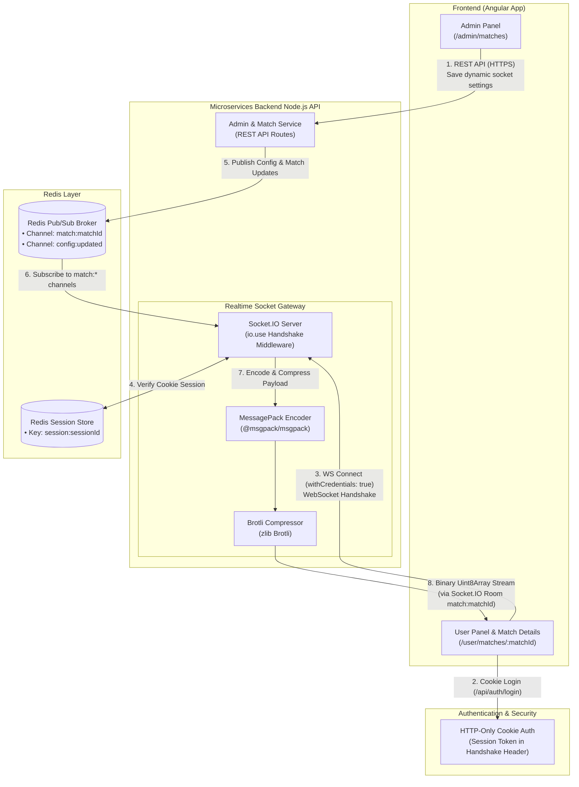
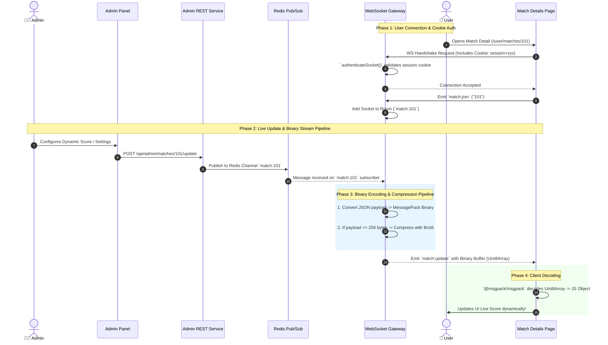
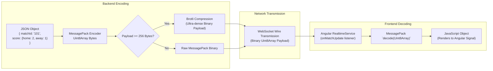

# System Architecture & Data Flow Diagrams

This document contains visual diagrams illustrating the overall architecture, authentication flow, real-time message pipeline, and data transformation process for the **Match Realtime API**.

---

## 🏗️ 1. Overall System Architecture Diagram

This diagram shows how the **Admin App**, **User App**, **Microservice Backend**, **Redis Pub/Sub**, and **Socket Gateway** interact with each other.

---

## 🔄 2. Step-by-Step Data Flow Diagram

The sequence of events when a user opens a live match detail page and receives real-time binary updates triggered by backend events/admin actions:

---

## 📦 3. Data Transformation Pipeline

How JSON Data transforms into MessagePack Binary & Brotli compressed bytes on backend, and decodes on frontend:

---

## 📋 Core Architectural Concepts Summary

1. **Cookie-Based Socket Authentication:** WebSocket upgrade handshake checks HTTP `session` cookie header using `authenticateSocket()` middleware.
2. **Binary Data Format:** Payloads are serialized using `@msgpack/msgpack` (`Uint8Array`) instead of JSON string representations.
3. **Payload Compression:** Messages $\ge$ 256 bytes undergo Brotli compression (`zlib` `brotliCompressSync`) to optimize bandwidth usage.
4. **Redis Pub/Sub Event Broker:** Decouples REST API state changes from WebSocket servers, allowing horizontal scaling across microservices.
5. **Dynamic Room Subscriptions:** Socket clients join dedicated room identifiers (`match:<matchId>`), listening only to relevant real-time update channels.
